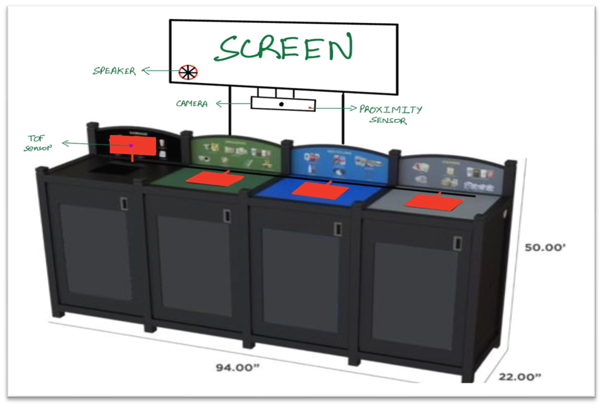

# Background

All around the globe, waste segregation is an integral factor in maintaining a sustainable environment. Since the natural resources of the world are being rapidly depleted, the world population relies heavily on recyclable materials, both within their households and at businesses. As the utilization of recyclable materials increases, so does the volume of recyclable materials disposed from each household. To ease the responsibilities of recycling contractors, every individual should ideally be mindful of their respective waste disposal practices.  
 
After conversing with multiple contractors and conducting several surveys with numerous stakeholders, the team discovered that the most difficult challenge for the recycling and waste disposal industry is the segregation of waste into their respective categories. The number of overlapping waste streams creates confusion as to where a specific item should be disposed of. The problem is further compounded as waste streams can vary between municipalities and businesses. As most people are still unaware about the proper method for division and disposal of their waste, most of it ends up in the same bin, which in turn end up in landfills or oceans. 

The main issue faced by the general population is the number of different categories that waste can be diverted into. This problem is faced at and should be resolved at the root level to combat waste contamination. More importantly, there exists a need to build a system that autonomously assists individuals in segregation of waste into their respective bins. Furthermore, this system can be installed on multiple bins present in public areas, universities, malls and so on.

# Our Product

The team had to come up with a system that assists everyone in proper disposal of waste to prevent waste contamination. The system had to be modular for installation on already existing bins. It also needed to work offline with minimum power consumption, be relatively inexpensive and be built out of strong materials to withstand heavy usage for installation in public places. Most importantly, the main objective of the system is to have minimum physical contact with each individual and to detect the waste category within 1 seconds.

The team would love to introduce to you the Computer Vision Aided Garbage Disposal System. The System would help each person by scanning their waste and informing them as to what receptacle each piece and component of their waste should be diverted to. The best part about it is that you won’t have to touch anything, eliminating all concerns about germ transfer! 
  

# Working of the Product

_Here is how the System will work:_
*	The user scans their waste item by holding it up in front of the Camera
*	The camera takes multiple images of the product itself, while still maintaining the user’s privacy
*	A vision-aided machine learning begins analysing all the images upon capture to detect the presented waste categories
*	After the waste types are detected, the system presents the user with instructions on how to properly dispose of their waste
*	Simultaneously, all the receptacles that the waste should be directed into will open their flaps, allowing the user to toss their waste into the right stream even if they’re in a rush and cannot see the instructions 
* The entire process takes only 1 second with no contact between the user and the bin
*	The system further integrates with Plant Operations, monitoring the level of waste in each receptacle and raising a flag when a receptacle is full

# The Team Itself

_Ayush Mittal - Software Design:_

*	Ayush is experienced with data science with interest in Machine learning and Deep Learning. He is pursuing AI option in the university giving him required 

_Prashuk Jain - System Integration:_

*	Prashuk is experienced in data science and working with different types of machine. He is really good in understanding the structures of various datasets and multiple systems communicate with each other.

_Tushar Gupta - Electrical Design :_
*	Tushar is experienced with different sensors and actuators as well as reading and creating circuit diagrams. He also has hands on experience with different electrical design processes like soldering, circuit troubleshooting etc.

_Ian Truong - Mechanical Design  :_
*	Ian is experienced with mechanical assemblies in industrial automation contexts, having an understanding of the design choices required for effective operation of automated production lines. 

